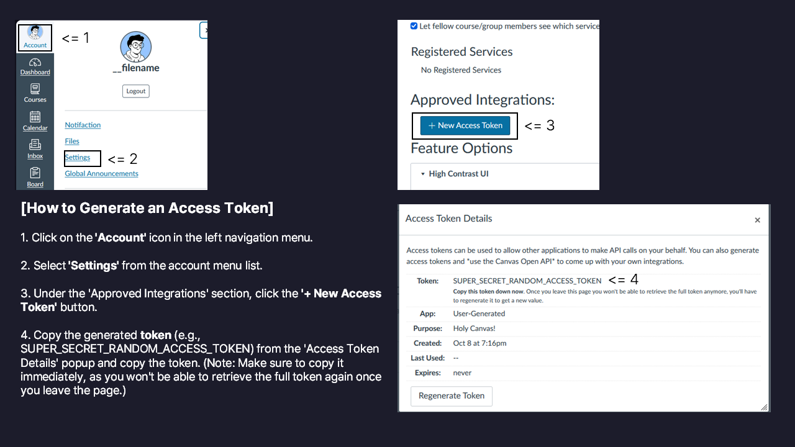

# holy-canvas (`hcvs`)

[](LICENSE)
[](#installation)
[-brightgreen.svg>)](#installation)
[](package.json)
[](#internationalization-i18n)

> **Next-generation Canvas LMS terminal client (TUI / CLI)**  
> A fast, modern, and keyboard-driven terminal application for students, teaching assistants, and educators using Canvas LMS.  
> Access your enrolled courses, check grades, track quiz submissions, and perform high-speed lecture file downloads and smart incremental sync—all directly from your terminal using `holy-canvas` or the shorthand alias `hcvs`.

---

## Table of Contents

- [Key Features](#key-features)
- [Installation](#installation)
  - [1. Linux / macOS (Zero-Dependency One-Liner)](#1-linux--macos-standalone-installation-without-nodejs)
  - [2. Windows PowerShell (Zero-Dependency One-Liner)](#2-windows-powershell-standalone-installation-without-nodejs)
  - [3. From Local Repository](#3-from-local-repository)
  - [4. Via Node.js / Package Manager](#4-via-nodejs--package-manager-for-developers)
- [Quick Start](#quick-start)
- [Usage & Commands](#usage--commands)
  - [1. Interactive SPA Mode (TUI)](#1-interactive-spa-mode-default)
  - [2. Direct CLI Subcommands](#2-direct-cli-subcommands)
- [Internationalization (i18n)](#internationalization-i18n)
- [AI Agent & Automation Integration (`--json`)](#ai-agent--automation-integration---json)
- [Uninstallation](#uninstallation)
- [Development & Building](#development--building)
- [Contributing](#contributing)
- [License](#license)

---

## Key Features

- **Zero-Dependency Standalone Runtime**: Instantly runnable on Linux and Windows without requiring system-wide Node.js or npm.
- **Interactive TUI SPA**: A sleek, full terminal single-page application operated entirely via arrow keys and Enter.
- **Shorthand Alias (`hcvs`)**: Use the quick `hcvs` command anytime as an alias for `holy-canvas`.
- **Native 5-Language Support (i18n)**: English (default), Korean (`ko`), Spanish (`es`), Japanese (`ja`), and Simplified Chinese (`zh`).
- **One-Stop Authentication & Diagnostic (`setup`)**: Live verification of your institution's Canvas domain and API access token with secure local credential storage.
- **Course Overview (`courses`)**: List all active enrolled courses, course codes, enrollment states, and course IDs.
- **Real-Time Grade Tracking (`grades`)**: Inspect current scores, final scores, and letter grades across all courses.
- **Quiz Submissions (`quizzes`)**: Review submitted quizzes, kept scores vs. points possible, and completion dates.
- **Smart File Downloads & Sync (`files`)**:
  - Bulk download all course files across all enrolled classes at once.
  - Interactive file browser with keyboard multi-selection (`Space` to toggle, `a` to select all).
  - Responsive virtual scrolling (windowing) that adapts cleanly to terminal height.
  - Incremental smart sync (`--sync`): Compares local file size and modification time against remote Canvas timestamps, skipping already up-to-date files.
  - Real-time progress bar with byte counter and folder hierarchy preservation.
- **AI Agent & Pipeline Integration (`--json`)**: Every command supports `--json` for clean, machine-readable standard JSON output.

---

## Installation

You **do not need Node.js or npm installed on your system** to use `holy-canvas`. The standalone installer downloads an isolated, zero-footprint runtime that does not pollute your global environment.

### 1. Linux / macOS

Run this one-liner in your terminal:

```bash
curl -fsSL https://raw.githubusercontent.com/filename24/holy-canvas/stable/scripts/install.sh | bash
```

Reload your shell configuration to apply the new path:

```bash
source ~/.bashrc   # Or for zsh users: source ~/.zshrc
```

### 2. Windows PowerShell

Open Windows PowerShell and run:

```powershell
irm https://raw.githubusercontent.com/filename24/holy-canvas/stable/scripts/install.ps1 | iex
```

Once installed, restart your PowerShell window or execute `hcvs` / `holy-canvas` directly.

### 3. From Local Repository

You can also clone the repository and run the installer locally:

**Linux / macOS:**

```bash
git clone https://github.com/filename24/holy-canvas.git
cd holy-canvas
./scripts/install.sh
```

**Windows (PowerShell):**

```powershell
git clone https://github.com/filename24/holy-canvas.git
cd holy-canvas
powershell -ExecutionPolicy Bypass -File .\scripts\install.ps1
```

### 4. Via Node.js / Package Manager (For Developers)

If you already have Node.js (>= 16) and pnpm installed:

```bash
git clone https://github.com/filename24/holy-canvas.git
cd holy-canvas
pnpm install
pnpm build
npm link
```

---

## Quick Start

### 1. Initial Authentication (`setup`)

Connect your Canvas LMS account (only required once upon first use):

```bash
hcvs setup
# or: holy-canvas setup
```

1. **Enter your Canvas domain**:
   - e.g., `canvas.harvard.edu`, or `https://canvas.instructure.com`
2. **Enter your API access token**:
   - Log in to your Canvas Web portal -> Profile / Account (top-left) -> **Settings** -> scroll to **Approved Integrations** -> click **+ New Access Token** -> generate and copy the token.
3. The setup wizard validates your credentials with Canvas in real time and stores them securely.


---

## Usage & Commands

You can execute commands using either `holy-canvas` or the shorthand `hcvs`.

### 1. Interactive SPA Mode (Default)

Running the command without any subcommand launches the interactive TUI application:

```bash
hcvs
```

#### Keyboard Controls:

- `Up` / `Down` / `PageUp` / `PageDown`: Navigate through items
- `Enter`: Select option or start download
- `Space`: Toggle file selection checkbox
- `a`: Select / deselect all files
- `s`: Toggle sync mode on/off
- `ESC` or `q`: Return to previous menu / Exit application

#### Main Menu Sections:

- **View Courses**: Browse enrolled classes and course codes
- **Check Grades**: View current scores, final scores, and grades
- **Quiz Scores**: Review submitted quizzes and test scores
- **Download / Sync Files**: Download individual course files or bulk download all courses
- **Language Settings**: Switch between 5 display languages in real time
- **Settings**: Reconfigure institution domain and API token
- **Exit**: Quit the CLI

---

### 2. Direct CLI Subcommands

Direct subcommands are ideal for scripts, shortcuts, and quick lookups:

#### Courses (`courses`)

```bash
# List all active enrolled courses
hcvs courses

# Inspect details for a specific course ID
hcvs courses --id 12345
```

#### Grades (`grades`)

```bash
# View grades across all enrolled courses
hcvs grades

# View grades for a specific course ID
hcvs grades --course 12345
```

#### Quizzes (`quizzes`)

```bash
# View all quiz submissions across all courses
hcvs quizzes

# View quiz submissions for a specific course ID
hcvs quizzes --course 12345
```

#### Lecture Files Download & Smart Sync (`files`)

```bash
# Bulk download all files across ALL enrolled courses
hcvs files --all

# Smart sync: download only new or modified files across ALL courses
hcvs files --all --sync

# Open interactive file browser for a specific course
hcvs files --course 12345

# Sync only updated files for a specific course
hcvs files --course 12345 --sync

# Specify custom destination directory (default: ./canvas-files)
hcvs files --all --dest ./my-lectures
```

---

## Internationalization (i18n)

The CLI defaults to English (`en`) and includes complete translations for 5 languages:

| Language Code | Language                | Native Name     | Region                         |
| :-----------: | :---------------------- | :-------------- | :----------------------------- |
|     `en`      | **English** _(Default)_ | English (US/UK) | Global standard                |
|     `ko`      | **Korean**              | 한국어          | South Korea universities       |
|     `es`      | **Spanish**             | Español         | Spain & Latin America          |
|     `ja`      | **Japanese**            | 日本語          | Japan universities             |
|     `zh`      | **Simplified Chinese**  | 简体中文        | Greater China higher education |

### Overriding Language via Flag (`--lang <code\>`)

You can override the display language on any invocation using `--lang`:

```bash
# Launch interactive TUI in Korean
hcvs --lang ko

# Launch interactive TUI in Spanish
hcvs --lang es

# Launch interactive TUI in Japanese
hcvs --lang ja

# Launch interactive TUI in Simplified Chinese
hcvs --lang zh

# Run subcommands in another language
hcvs courses --lang ko
```

---

## AI Agent & Automation Integration (`--json`)

Every subcommand supports the `--json` option. When `--json` is supplied, interactive TUI rendering is suppressed, and pure, formatted JSON is streamed to standard output (`stdout`).

This is designed for seamless integration with **AI Agents (Claude code, Codex, Github Copilot etc...)**, shell scripts, and automated data pipelines:

```bash
# Parse enrolled courses as JSON
hcvs courses --json

# Extract grade summaries as JSON
hcvs grades --json

# Extract grades for a specific course as JSON
hcvs grades --course 12345 --json

# Extract quiz submission history as JSON
hcvs quizzes --course 12345 --json

# Extract complete file list and folder structure as JSON
hcvs files --course 12345 --json
```

---

## Uninstallation

To completely remove `holy-canvas` from your system, run the uninstallation script:

**Linux / macOS:**

```bash
curl -fsSL https://raw.githubusercontent.com/filename24/holy-canvas/stable/scripts/uninstall.sh | bash
# Or locally: ./scripts/uninstall.sh
```

**Windows (PowerShell):**

```powershell
irm https://raw.githubusercontent.com/filename24/holy-canvas/stable/scripts/uninstall.ps1 | iex
# Or locally: powershell -ExecutionPolicy Bypass -File .\scripts\uninstall.ps1
```

---

## Development & Building

For local development and testing:

```bash
# Install dependencies
pnpm install

# Build TypeScript source
pnpm build

# Incremental watch mode
pnpm dev

# Run Prettier code formatter, XO linter, and AVA test suite
pnpm test

# Package cross-platform standalone binaries
pnpm run package
```

---

## Contributing

Contributions, bug reports, and feature suggestions are welcome!

1. Fork the repository.
2. Create your feature branch (`git checkout -b feat/amazing-feature`).
3. Commit your changes (`git commit -m 'feat: Add amazing feature'`).
4. Ensure all tests and lint checks pass (`pnpm test`).
5. Push to the branch (`git push origin feat/amazing-feature`).
6. Open a Pull Request.

---

## License

This project is licensed under the **GNU Affero General Public License v3.0 (AGPL-3.0)**.  
See the [LICENSE](LICENSE) file for details.
